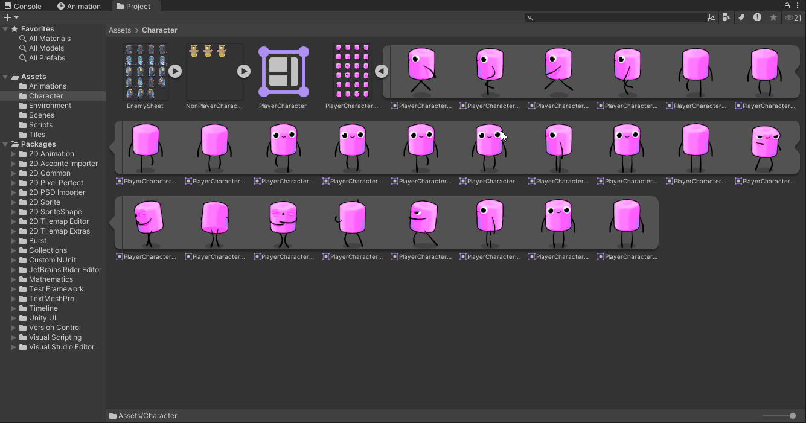
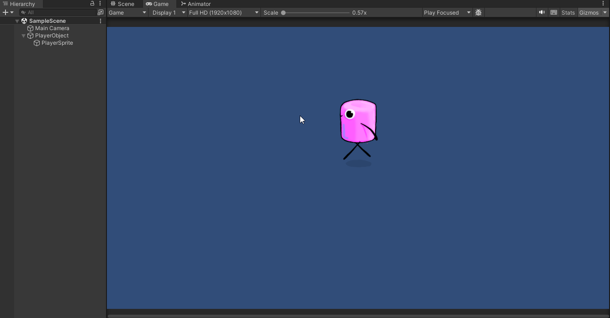
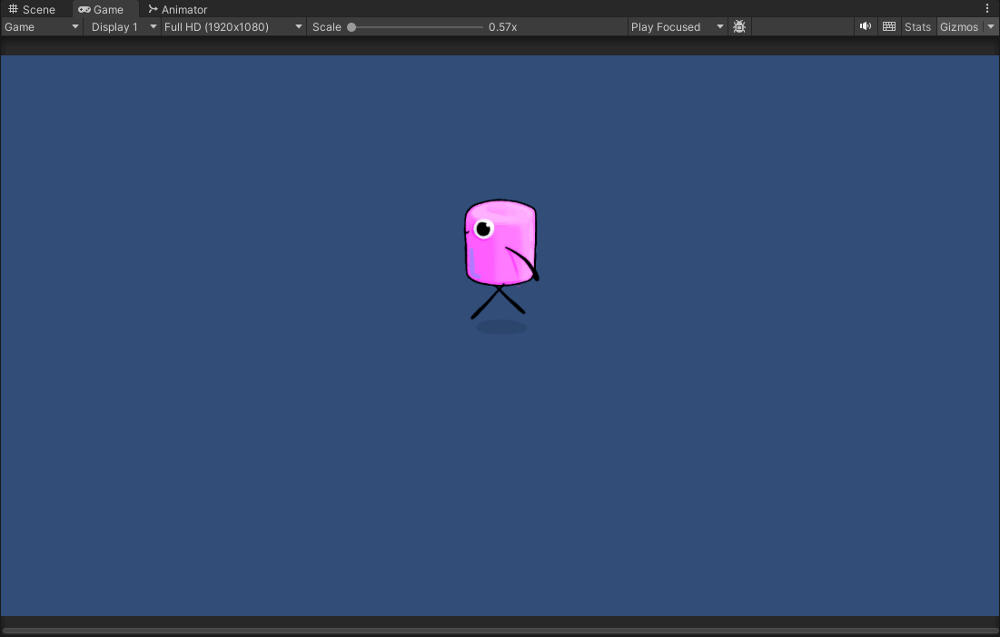

# Fundamentos del desarrollo de videojuegos
### Diego Herrera Mendoza
Sprites

1. Agregar el atlas de sprites del personaje a la escena. Configurar el sprite como múltiple y subdividirlo para tener acceso a los sprites para generar las animaciones. Agregar una de las imágenes a la escena.

---
2. Creamos un objeto 2D, arrastrando un conjunto de imágenes que selecciones al objeto añadiremos una animación. Agregar al personaje la animación “Walk Down” . Añadir otra imagen y generarle otra animación.  De esa forma Unity crea un objeto Animation, la primera vez que se crea, también añade un objeto Animator Controller.

---

3.  Creamos los scripts para controlar el movimiento para el personaje. Inicialmente vamos a hacer una versión sin salto. Añadir los scripts necesarios para moverlo por la pantalla. En este caso sólo tendremos que mover las coordenadas (X, Y).
4. Además necesitamos que el sprite se oriente hacia donde camina, podemos hacerlo usando la propiedad Flip en el eje X en función de si se está moviendo hacia la izquierda (movimiento negativo) o hacia la derecha (movimiento positivo).

---

5. Crear las animaciones del personaje: Para cada animación que queramos agregar a un objeto seleccionamos la colección de sprites que forman la animación y la arrastramos hasta él. Agregaremos todas las animaciones al personaje. El objeto Animator Controller las gestiona en la ejecución.

- Script: [Movimiento](scripts/PlayerMovement.cs)

